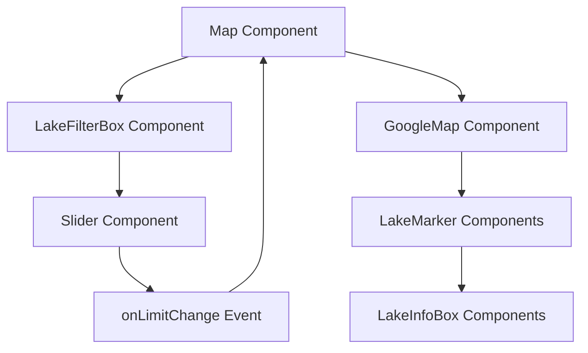

```mermaid
graph TD;
  A[Map Component] --> B[LakeFilterBox Component]
  B --> C[Slider Component]
  C --> D[onLimitChange Event]
  D --> A

  A --> E[GoogleMap Component]
  E --> F[LakeMarker Components]
  F --> G[LakeInfoBox Components]
```