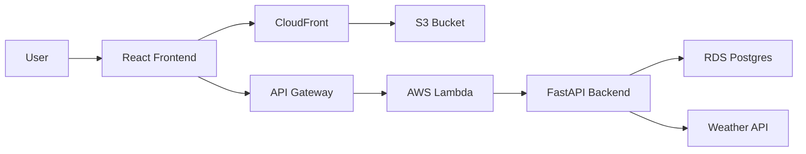
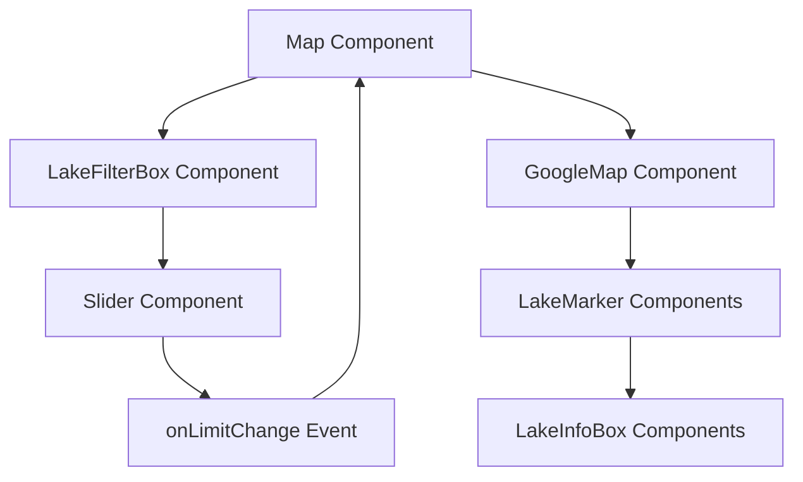

# Fullstack Architecture Diagram

```mermaid
graph LR;
  A[User] --> B[React Frontend]
  B --> C[CloudFront]
  C --> D[S3 Bucket]
  B --> F[API Gateway]
  F --> G[AWS Lambda]
  G --> H[FastAPI Backend]
  H --> I[RDS Postgres]
  H --> J[Weather API]
```

# Diagram of React components

```mermaid
graph TD;
  A[Map Component] --> B[LakeFilterBox Component]
  B --> C[Slider Component]
  C --> D[onLimitChange Event]
  D --> A

  A --> E[GoogleMap Component]
  E --> F[LakeMarker Components]
  F --> G[LakeInfoBox Components]
```