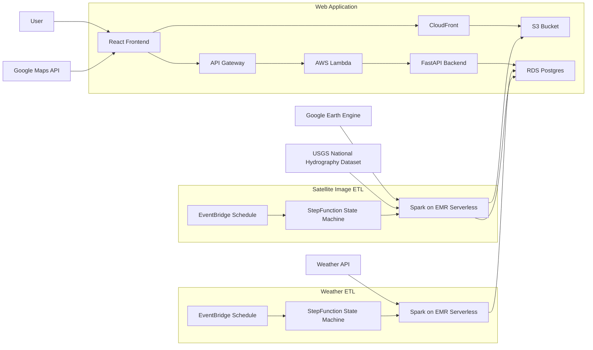

# React Weather Map Application

This is a web application built with React that displays weather information for lakes on a map.

## Features

- Display lakes on a Google Map with weather information markers.
- Predict the amount of ice on each lake.
- Filter the number of lakes displayed on the map using a slider.
- Hover over a lake marker to view detailed weather information in an info window.
- Cluster markers for improved performance and visualization.

# Fullstack Architecture Diagram

# React Components Diagram

